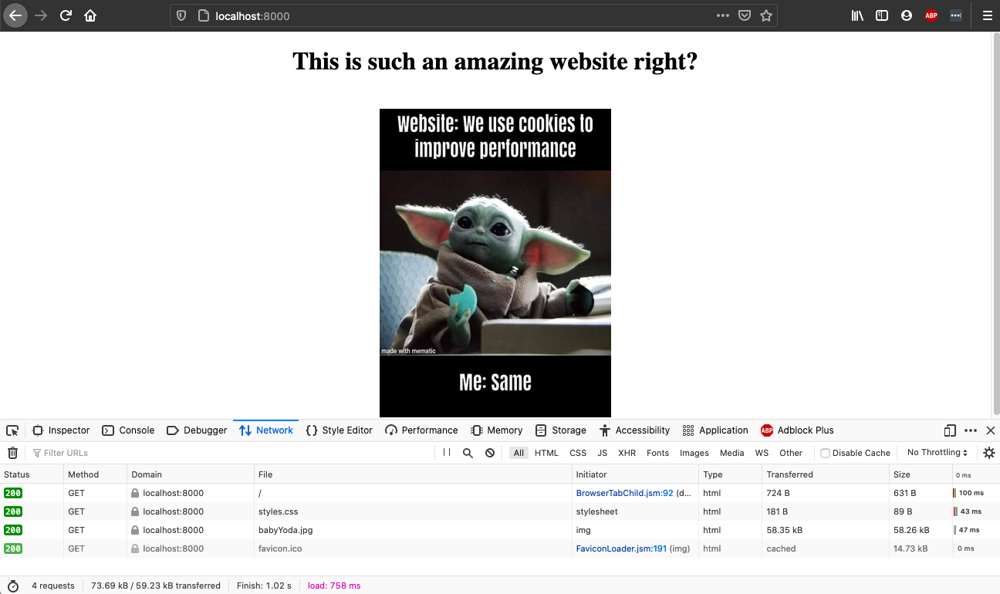

Web Server built with Java 7 that is able to host a
website, listen to requests and send Headers/HTML files.
 
 
It also includes a ServerCrash program used to test whether
the server can answer to multiple requests concurrently, to
which it passed the test with 5000 requests.
 
 
Below is an example of the functioning requests:
 
